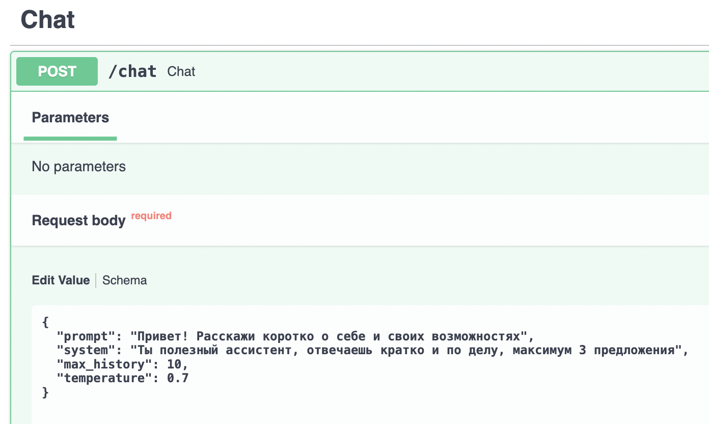
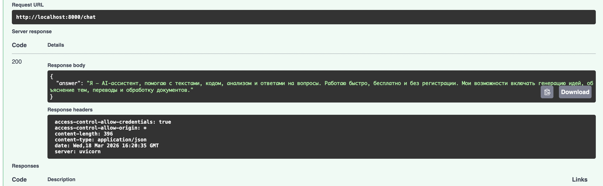
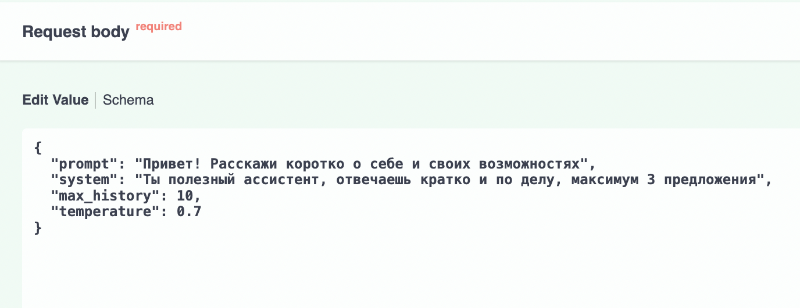
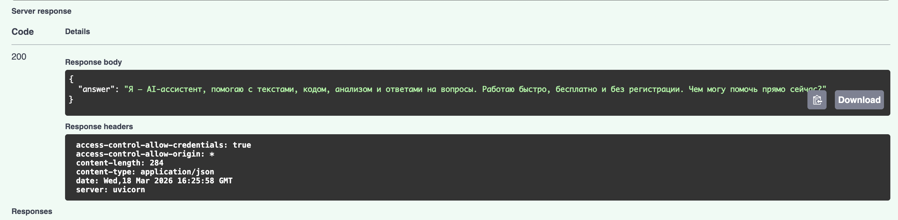
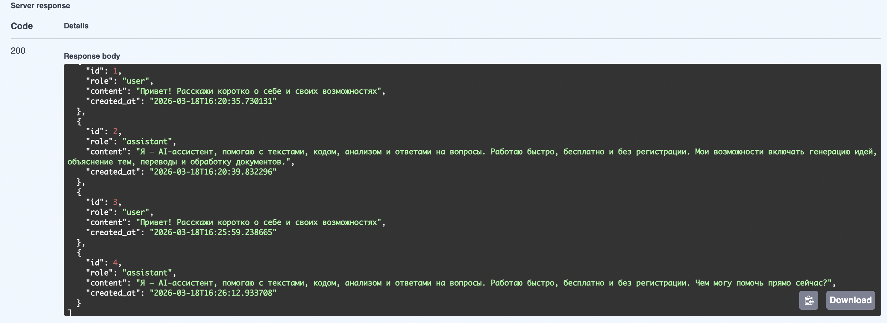

# LLM-P — FastAPI сервис с JWT аутентификацией и интеграцией OpenRouter

Серверное приложение на FastAPI, предоставляющее защищённый API для взаимодействия с большой языковой моделью (LLM) через сервис OpenRouter. Реализована аутентификация JWT, хранение данных в SQLite и разделение ответственности между слоями приложения.

## 🔧 Архитектура проекта
## Структура проекта

```
llm_p/
├── pyproject.toml                 # Зависимости проекта (uv)
├── README.md                      # Описание проекта и запуск
├── .env.example                   # Пример переменных окружения
│
├── app/
│   ├── __init__.py
│   ├── main.py                    # Точка входа FastAPI
│   │
│   ├── core/                      # Общие компоненты и инфраструктура
│   │   ├── __init__.py
│   │   ├── config.py              # Конфигурация приложения (env → Settings)
│   │   ├── security.py            # JWT, хеширование паролей
│   │   └── errors.py              # Доменные исключения
│   │
│   ├── db/                        # Слой работы с БД
│   │   ├── __init__.py
│   │   ├── base.py                # DeclarativeBase
│   │   ├── session.py             # Async engine и sessionmaker
│   │   └── models.py              # ORM-модели (User, ChatMessage)
│   │
│   ├── schemas/                   # Pydantic-схемы (вход/выход API)
│   │   ├── __init__.py
│   │   ├── auth.py                # Регистрация, логин, токены
│   │   ├── user.py                # Публичная модель пользователя
│   │   └── chat.py                # Запросы и ответы LLM
│   │
│   ├── repositories/              # Репозитории (ТОЛЬКО SQL/ORM)
│   │   ├── __init__.py
│   │   ├── users.py               # Доступ к таблице users
│   │   └── chat_messages.py       # Доступ к истории чатов
│   │
│   ├── services/                  # Внешние сервисы
│   │   ├── __init__.py
│   │   └── openrouter_client.py   # Клиент OpenRouter / LLM
│   │
│   ├── usecases/                  # Бизнес-логика приложения
│   │   ├── __init__.py
│   │   ├── auth.py                # Регистрация, логин, профиль
│   │   └── chat.py                # Логика общения с LLM
│   │
│   └── api/                       # HTTP-слой (тонкие эндпоинты)
│       ├── __init__.py
│       ├── deps.py                # Dependency Injection
│       ├── routes_auth.py         # /auth/*
│       └── routes_chat.py         # /chat/*
│
└── app.db                         # SQLite база (создаётся при запуске)
```


## 🔧 Технологии

- **FastAPI** — современный веб-фреймворк
- **JWT** — аутентификация и авторизация
- **SQLite + SQLAlchemy** — хранение данных
- **OpenRouter API** — доступ к LLM
- **uv** — быстрый менеджер зависимостей

## ⚙️ Установка и запуск

### 1. Клонирование репозитория
```bash
git clone https://github.com/Skycode001/FastAPI-service-with-JWT-auth-and-OpenRouter-LLM-proxy.git
cd llm-p
```

### 2. Установка зависимостей
```bash
pip install uv
uv venv
source .venv/bin/activate  # для MacOS/Linux
uv pip install -r <(uv pip compile pyproject.toml)
```

### 3. Настройка переменных окружения
```bash
cp .env.example .env
Отредактируйте .env, добавьте OPENROUTER_API_KEY
```

### 4. Запуск приложения
```bash
uv run uvicorn app.main:app --reload --host 0.0.0.0 --port 8000
```
## 🚀 Демонстрация работы. Вопрос - Ответ к LLM

### Отправка запроса к LLM (пример1)

### Ответ LLM (пример1)


### Отправка запроса к LLM (пример2)

### Ответ LLM (пример2)


## 🚀 Получение истории диалога

### Отправка запроса к LLM (пример1)



## 🔧 API Endpoints

| Метод | Эндпоинт | Описание | Доступ |
|-------|----------|----------|--------|
| `POST` | `/auth/register` | Регистрация пользователя | Публичный |
| `POST` | `/auth/login` | Вход, получение JWT | Публичный |
| `GET` | `/auth/me` | Профиль текущего пользователя | Требует JWT |
| `POST` | `/chat` | Отправка запроса к LLM | Требует JWT |
| `GET` | `/chat/history` | История диалога | Требует JWT |
| `DELETE` | `/chat/history` | Очистка истории | Требует JWT |
| `GET` | `/health` | Проверка работоспособности | Публичный |

## 🔧 Переменные окружения

| Переменная | Описание | Пример |
|------------|----------|--------|
| `APP_NAME` | Название приложения | `llm-p` |
| `JWT_SECRET` | Секретный ключ для JWT | `your-secret-key` |
| `JWT_ALG` | Алгоритм JWT | `HS256` |
| `ACCESS_TOKEN_EXPIRE_MINUTES` | Время жизни токена | `60` |
| `SQLITE_PATH` | Путь к БД | `./app.db` |
| `OPENROUTER_API_KEY` | API ключ OpenRouter | `sk-or-v1-...` |
| `OPENROUTER_MODEL` | Модель LLM | `stepfun/step-3.5-flash:free` |

## 🔧 Форматирование и линтинг
```bash
ruff check .
ruff format .
```